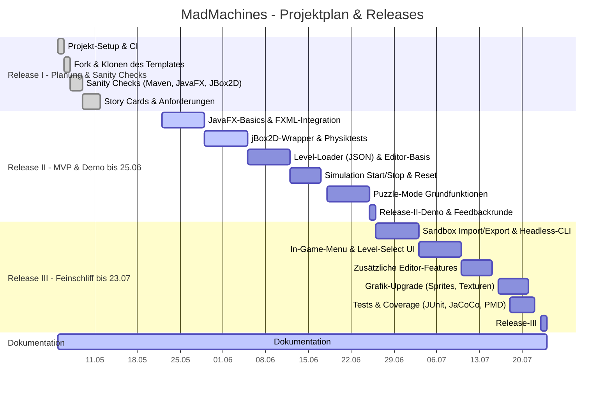

# Mad Machines - Hinweise zu Release I:

## Sanity Checks
In dieser Datei sind alle durchgeführten Sanity Checks dokumentiert. Jeder von uns hat sich mit neuen Tools (z.B. Maven, JavaFX, jBox2D) vertraut gemacht und das Vorgehen festgehalten. Ziel war es, mögliche Risiken frühzeitig zu erkennen.

-> [Sanity Checks Dokumentation](docs/sanity_checks.md)

## Anforderungsdokument
Dieses Dokument beschreibt unser Spielkonzept vollständig – inkl. Spielidee, Nutzerinteraktionen, geplanten Features (Pflicht- und Wahlfunktionen), Einschränkungen und nicht-funktionalen Anforderungen. Es dient als gemeinsame Basis für Planung, Umsetzung und spätere Erweiterungen.

-> [Anforderungsdokument](docs/Anforderungsdokument.pdf)

## Story Cards
Unsere Story Cards wurden auf Basis der Projektanforderungen entwickelt. Sie beschreiben die wichtigsten Funktionen aus Sicht der Nutzer:innen und helfen dabei, alle Features konkret und testbar zu formulieren. Die Karten liegen als strukturierte Übersicht mit Akzeptanzkriterien vor.

-> [Story Cards](docs/Story%20Cards.pdf)

## Projektplan und Arbeitspakete
Diese geben zeitliche Orientierung, dokumentieren Abhängigkeiten und zeigen den Fortschritt im Verlauf der Releases.

| WP    | Name                                                     | Verantwortlich | Start      | Dauer (Tage) | Release  | Abhängigkeit |
|-------|----------------------------------------------------------|----------------|------------|--------------|----------|------------|
| WP1   | Projekt-Setup & CI                                       | Sophia         | 2025-05-05 | 1            | R I      | –          |
| WP2   | Fork & Klonen des Gitlab-Templates                       | beide          | 2025-05-06 | 1            | R I      | WP1        |
| WP3   | Sanity Checks (Maven, JavaFX, JBox2D…)                   | beide          | 2025-05-08 | 2            | R I      | WP2        |
| WP4   | Story Cards & Anforderungsdokumente                      | beide          | 2025-05-13 | 3            | R I      | WP3        |
| WP5   | JavaFX-Basics & FXML-Integration                         | beide          | 2025-05-22 | 7            | R II     | WP3        |
| WP6   | jBox2D-Wrapper & erste Physiktests                       | Niklas         | 2025-05-29 | 7            | R II     | WP3        |
| WP7   | Level-Loader (JSON) & Editor-Basis                       | Sophia         | 2025-06-05 | 7            | R II     | WP5, WP6   |
| WP8   | Simulation Start/Stop & Reset-Funktion                   | beide          | 2025-06-12 | 5            | R II     | WP6        |
| WP9   | Puzzle-Mode Grundfunktionen (Inventory, Zonen, Win-Check) | beide | 2025-06-18 | 7            | R II | WP8        |
| WP10  | Release-II-Demo & Feedbackrunde                          | beide          | 2025-06-25 | 1            | R II     | WP9        |
| WP11  | Sandbox Import/Export & Headless-CLI                     | Sophia         | 2025-06-26 | 7            | R III    | WP7        |
| WP12  | In-Game-Menu, Options & Level-Select UI                  | Niklas         | 2025-07-03 | 7            | R III    | WP8        |
| WP13  | Zusätzliche Features (Drag&Drop, Undo/Redo)              | beide      | 2025-07-10 | 5            | R III    | WP7        |
| WP14  | Grafik-Upgrade (Sprites, Texturen…)                      | beide          | 2025-07-16 | 5            | R III    | WP12       |
| WP15  | Tests & Coverage (JUnit, JaCoCo, PMD)                    | Sophia         | 2025-07-18 | 4            | R III    | WP9, WP13  |
| WP16  | Dokumentation & Verpackung (PDFs, Javadoc)               | beide       | 2025-05-05 | 80           | R III    |            |

Gantt-Chart aus der Markdown Tabelle der Arbeitspakete erstellt:

## Projektstruktur
In der Projektstruktur-Datei dokumentieren wir unsere aktuelle Verzeichnisstruktur mit Erklärungen zu den wichtigsten Ordnern.

-> [Projektstruktur](docs/Projektstruktur.txt)

## Team und Rollen
Unser Team besteht aus zwei Mitgliedern: Niklas und Sophia. Die Verantwortlichkeiten haben wir wie folgt aufgeteilt:
Niklas ist für die Architektur und Physik zuständig, während Sophia das Testing sowie die Projektleitung übernimmt.
GUI, Leveldesign und die Dokumentation bearbeiten wir gemeinsam.

Da wir nur zu zweit sind, ist eine klare Aufgabenzuweisung hilfreich, dennoch werden wir viele Aufgaben gemeinsam bearbeiten. 
Die Aufteilung dient vor allem dazu, dass jeder den Überblick über bestimmte Bereiche behält und Verantwortung dafür 
trägt – mit dem Ziel, dass das Projekt als Ganzes im Team erfolgreich umgesetzt wird.

| Rolle                     | Person   | Hauptaufgaben                               |
|---------------------------|----------|--------------------------------------------|
| **Architektur & Physik**   | Niklas   | Softwarearchitektur, jBox2D-Integration, Core-Engine |
| **Testing & Projektleitung** | Sophia   | JUnit-Tests, CI-Pipeline, Zeitplancontrolling, Kommunikation |
| **GUI & Leveldesign**      | beide    | JavaFX-UI, JSON-Level-Format, Level-Balancing |
| **Dokumentation**          | beide    | Requirements, UML, User-Manual, Präsentation |

## Feature-Reduktionsvorschlag

Da unser Team ursprünglich auf vier Personen ausgelegt war, nun aber nur noch aus zwei aktiven Mitgliedern besteht, haben wir einen gezielten Reduzierungsvorschlag ausgearbeitet. Ziel ist es, trotz reduzierter Kapazitäten ein rundes und funktionsfähiges Endprodukt abzugeben.

### 1. Reduktion der Wahlfeatures

Statt der vollen Umsetzung von drei Wahlfeatures konzentrieren wir uns zunächst auf **zwei**:
- **Richtige Menüs** (z.B. Hauptmenü, Levelauswahl)
- **Verbesserter Level-Editor** (Drag & Drop, Undo/Redo)

Das ursprünglich geplante dritte Wahlfeature, das **Maschinen-Interface** (z.B. Headless Mode, Zustandsprotokoll), wird nur umgesetzt, sofern nach Release II ausreichend Zeit und Stabilität im Projektverlauf vorhanden ist.

### 2. Auswirkungen auf Planung und Dokumentation

Durch die gezielte Reduktion sinkt:
- der Implementierungsaufwand im zweiten Release,
- die Anzahl an Spezialtests (z.B. für nicht-GUI-Modi),
- und der Umfang der technischen Dokumentation im Bereich optionaler Features.

### Erweiterbarkeit bleibt bestehen

Die Reduktion ist bewusst so gewählt, dass alle nicht umgesetzten Inhalte modular nachrüstbar bleiben. Sollte sich im Projektverlauf Zeitreserven ergeben, werden weitere Features priorisiert ergänzt.

### Pflichtfeatures bleiben unberührt

Alle Kernfunktionen – Physiksimulation, Puzzle-Modus, Levelsystem, GUI, Tests, Dokumentation – werden vollständig umgesetzt.
Hier sehen wir leider keinerlei Möglichkeiten zur Reduktion, ohne das Spielerlebnis deutlich einzuschränken.

**Fazit:** Wir garantieren ein voll lauffähiges Spiel mit zwei durchdachten Wahlfeatures und klar dokumentierter Architektur.

.

.

.

.

.

.

.

## Ursprüngliches Template (enthält aktuell keine Informationen für Release I)

## Name

Choose a self-explaining name for your project.

## Description

Mad Machines ist ein physikbasiertes 2D-Puzzlespiel, bei dem die Spielenden Maschinenkomponenten – wie Zahnräder, Rampen, Förderbänder und Bälle – kombinieren, um bestimmte Aufgaben zu lösen. Dabei muss mit Hilfe dieser Komponenten ein Zielzustand erreicht werden. Das Spiel fördert Experimentierfreude, logisches Denken und ein Verständnis für einfache Mechanik.
Ziel dieses Projekts ist die Konzeption und Umsetzung eines reduzierten, aber erweiterbaren Physikpuzzlespiels, das sich an der Idee von Crazy Machines orientiert. Die Anwendung soll durch eine modulare Architektur eine spätere Integration KI-basierter Interaktionen ermöglichen. Fokus wir dabei auf die Physiksimulation, eine intuitive Benutzeroberfläche sowie umfassende Funktionen zur Erstellung eigener Level gelegt.

## Badges

On some READMEs, you may see small images that convey metadata, such as whether or not all the tests are passing for the
project. You can use Shields to add some to your README. Many services also have instructions for adding a badge.

## Visuals

Depending on what you are making, it can be a good idea to include screenshots or even a video (you'll frequently see
GIFs rather than actual videos). Tools like ttygif can help, but check out Asciinema for a more sophisticated method.

## Installation

Within a particular ecosystem, there may be a common way of installing things, such as using Yarn, NuGet, or Homebrew.
However, consider the possibility that whoever is reading your README is a novice and would like more guidance. Listing
specific steps helps remove ambiguity and gets people to using your project as quickly as possible. If it only runs in a
specific context like a particular programming language version or operating system or has dependencies that have to be
installed manually, also add a Requirements subsection.

## Usage

Use examples liberally, and show the expected output if you can. It's helpful to have inline the smallest example of
usage that you can demonstrate, while providing links to more sophisticated examples if they are too long to reasonably
include in the README.

## Support

Tell people where they can go to for help. It can be any combination of an issue tracker, a chat room, an email address,
etc.

## Roadmap

If you have ideas for releases in the future, it is a good idea to list them in the README.

## Contributing

State if you are open to contributions and what your requirements are for accepting them.

For people who want to make changes to your project, it's helpful to have some documentation on how to get started.
Perhaps there is a script that they should run or some environment variables that they need to set. Make these steps
explicit. These instructions could also be useful to your future self.

You can also document commands to lint the code or run tests. These steps help to ensure high code quality and reduce
the likelihood that the changes inadvertently break something. Having instructions for running tests is especially
helpful if it requires external setup, such as starting a Selenium server for testing in a browser.

## Authors and acknowledgment

Show your appreciation to those who have contributed to the project.

## License

For open source projects, say how it is licensed.

## Project status

If you have run out of energy or time for your project, put a note at the top of the README saying that development has
slowed down or stopped completely. Someone may choose to fork your project or volunteer to step in as a maintainer or
owner, allowing your project to keep going. You can also make an explicit request for maintainers.
